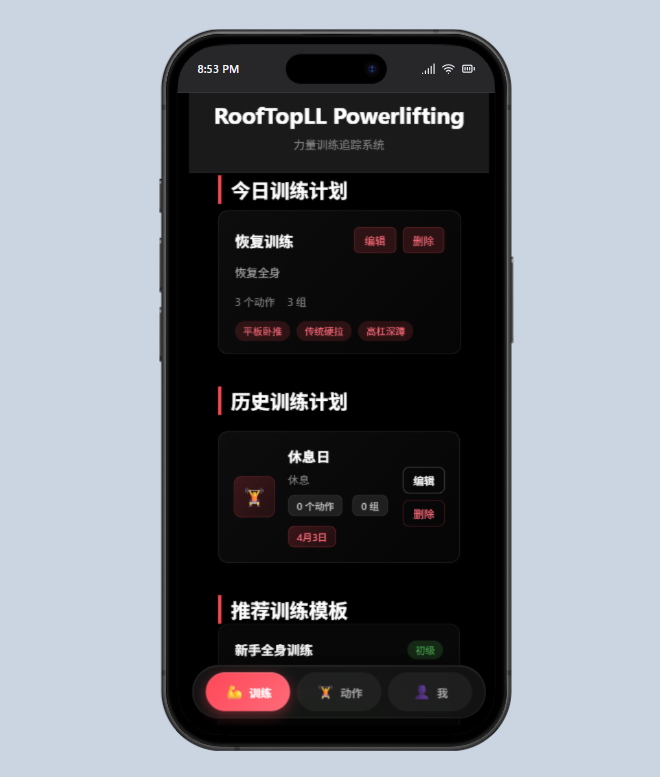
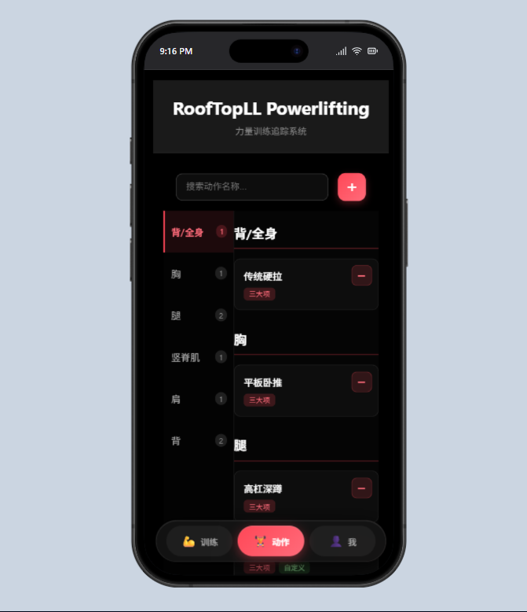
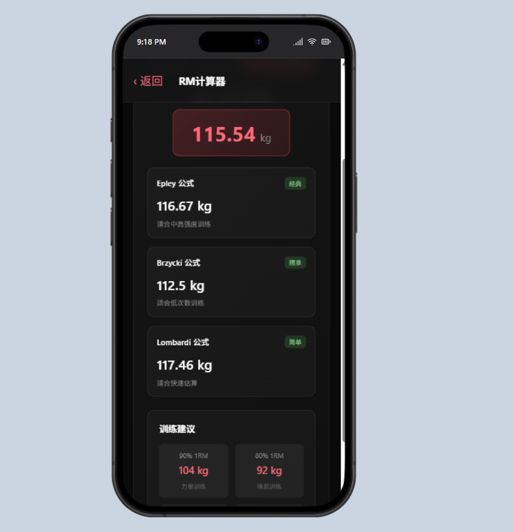
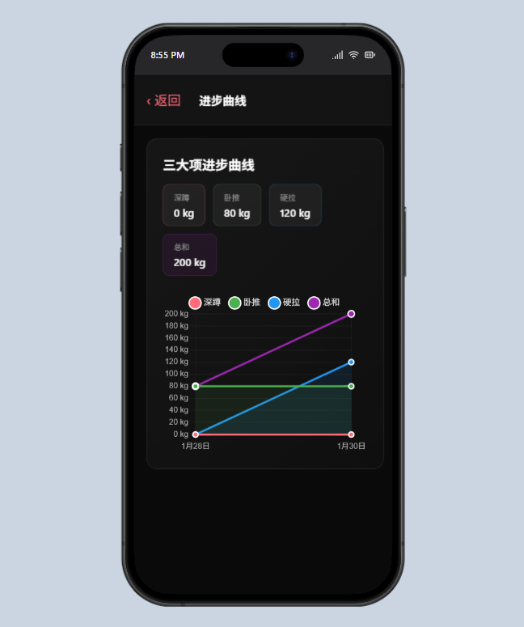
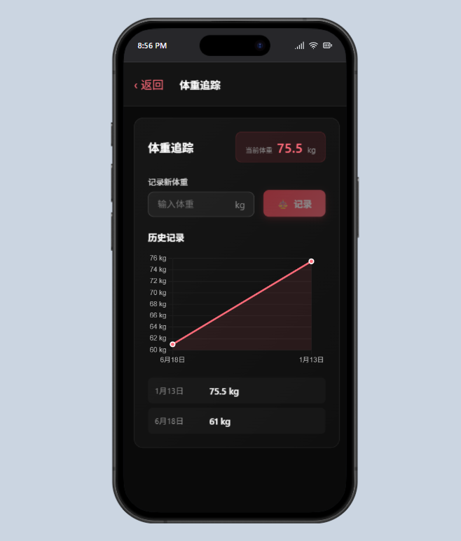
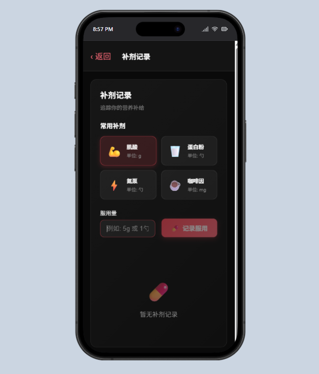
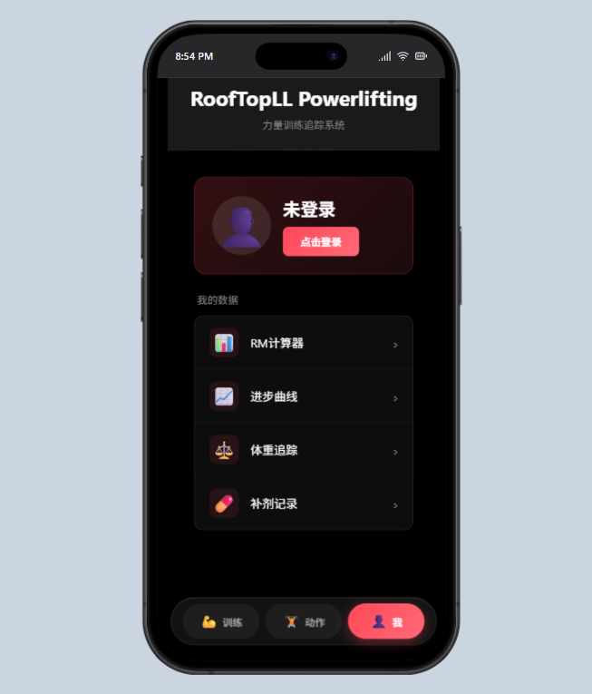

# 🏋️ RoofTopLL - 力量训练追踪系统

<div align="center">


**专业的力量训练数据追踪与分析平台**

[](https://spring.io/projects/spring-boot)
[](https://vuejs.org/)
[](https://www.oracle.com/java/)
[](https://www.typescriptlang.org/)

[在线演示](#) · [功能特性](#-功能特性) · [快速开始](#-快速开始) · [技术栈](#-技术栈)

</div>

---

## 📖 项目简介

RoofTopLL 是一款专为力量训练爱好者设计的训练追踪系统，帮助用户记录、分析和优化训练计划。支持三大项（深蹲、卧推、硬拉）数据追踪、RM计算、体重管理、补剂记录等功能。

### 🎯 设计理念

- **数据驱动**：通过可视化图表直观展示训练进步
- **简洁高效**：专注于核心功能，操作简单直观
- **科学训练**：提供RM计算、训练建议等科学工具

---

## ✨ 功能特性

### 📊 训练计划管理



- 创建和编辑训练计划
- 按周/月查看训练安排
- 支持自定义训练动作和组数

### 🏋️ 动作库



- 丰富的力量训练动作库
- 分类浏览：深蹲、卧推、硬拉、辅助训练
- 动作详情和训练建议

### 📈 RM 计算器



- 支持 Epley、Brzycki、Lombardi 三种公式
- 根据重量和次数估算单次最大重量（1RM）
- 提供不同训练强度的重量建议

### 📉 进步曲线



- 三大项成绩可视化图表
- 深蹲、卧推、硬拉、总成绩趋势
- 数据统计和进步分析

### ⚖️ 体重追踪



- 记录体重变化
- 体重趋势图表
- 历史记录查看

### 💊 补剂记录



- 常用补剂模板（肌酸、蛋白粉、氮泵等）
- 记录每日补剂服用情况
- 补剂历史追踪

### 👤 用户系统



- 用户注册与登录
- 个人训练数据管理
- 数据持久化存储

---

## 🛠️ 技术栈

### 后端

| 技术 | 版本 | 说明 |
|------|------|------|
| Java | 21 | 编程语言 |
| Spring Boot | 3.2.0 | 应用框架 |
| Spring Data JPA | - | 数据持久化 |
| H2 Database | - | 嵌入式数据库 |
| Maven | 3.9+ | 项目管理工具 |

### 前端

| 技术 | 版本 | 说明 |
|------|------|------|
| Vue.js | 3.4.0 | 前端框架 |
| TypeScript | 5.3.0 | 类型支持 |
| Vite | 5.0.0 | 构建工具 |
| Chart.js | 4.4.0 | 图表库 |
| vue-chartjs | 5.3.0 | Vue 图表组件 |

---

## 📁 项目结构
```text
RoofTopLL/
├── backend/                           # 后端 Spring Boot 项目
│   ├── src/main/java/com/ll/rooftopll/
│   │   ├── RoofTopllApplication.java  # 启动类
│   │   ├── controller/                # 控制器层（合并零散接口）
│   │   │   ├── ExerciseController.java
│   │   │   ├── SupplementController.java
│   │   │   ├── UserController.java
│   │   │   └── WorkoutController.java
│   │   ├── service/                   # 服务层
│   │   ├── model/                     # 数据模型 (entity/vo)
│   │   └── mapper/                    # 数据持久层
│   └── src/main/resources/
│       └── application.yml
│
├── frontend/                          # 前端 Vue 3 项目
│   ├── src/
│   │   ├── api/                       # 统一接口请求
│   │   ├── components/                # 公用组件 (RM计算、图表)
│   │   └── views/                     # 页面视图 (训练、动作库、追踪)
│   └── vite.config.ts
│
└── README.md                          # 项目说明文档


---

## 🚀 快速开始

### 环境要求

- **Java 21+**
- **Node.js 18+**
- **Maven 3.9+**

### 后端启动

```bash
# 进入后端目录
cd backend

# 编译项目
mvn clean install

# 启动后端服务
mvn spring-boot:run
```

后端服务将在 `http://localhost:8080` 启动

### 前端启动

```bash
# 进入前端目录
cd frontend

# 安装依赖
npm install

# 启动开发服务器
npm run dev
```

前端服务将在 `http://localhost:5173` 启动

### 访问应用

打开浏览器访问：`http://localhost:5173`

---

## 📡 API 文档

### 训练相关

| 接口 | 方法 | 说明 |
|------|------|------|
| `/api/workout/plans` | GET | 获取训练计划 |
| `/api/workout/plans` | POST | 创建训练计划 |
| `/api/workout/stats/big-three` | GET | 获取三大项数据 |

### 动作库

| 接口 | 方法 | 说明 |
|------|------|------|
| `/api/exercises` | GET | 获取所有动作 |
| `/api/exercises/{id}` | GET | 获取动作详情 |

### 工具

| 接口 | 方法 | 说明 |
|------|------|------|
| `/tool/rm-calc` | GET | RM计算 |

### 用户

| 接口 | 方法 | 说明 |
|------|------|------|
| `/user/register` | POST | 用户注册 |
| `/user/login` | POST | 用户登录 |
| `/user/weight` | POST | 记录体重 |
| `/user/weight/history` | GET | 获取体重历史 |

### 补剂

| 接口 | 方法 | 说明 |
|------|------|------|
| `/api/supplement/templates` | GET | 获取补剂模板 |
| `/api/supplement/log` | POST | 记录补剂服用 |

---

## 📸 界面展示

### 主界面


### 训练计划


### 数据分析


---

## 🎨 设计特点

- **深色主题**：护眼的深色界面设计
- **玻璃态效果**：现代化的毛玻璃 UI
- **流畅动画**：平滑的过渡和交互动画
- **响应式布局**：适配不同屏幕尺寸

---

## 🔧 配置说明

### 后端配置

```properties
# 数据库配置
spring.datasource.url=jdbc:h2:file:./data/rooftopll
spring.datasource.driverClassName=org.h2.Driver

# H2 控制台（开发环境）
spring.h2.console.enabled=true

# 服务器端口
server.port=8080
```

### 前端配置

```typescript
// vite.config.ts
export default defineConfig({
  server: {
    proxy: {
      '/api': 'http://localhost:8080',
      '/tool': 'http://localhost:8080',
      '/user': 'http://localhost:8080'
    }
  }
})
```

---

## 🤝 贡献指南

欢迎贡献代码、报告问题或提出建议！

1. Fork 本仓库
2. 创建特性分支 (`git checkout -b feature/AmazingFeature`)
3. 提交更改 (`git commit -m 'Add some AmazingFeature'`)
4. 推送到分支 (`git push origin feature/AmazingFeature`)
5. 提交 Pull Request

---

## 📝 开发计划

- [ ] 训练数据导出功能
- [ ] 训练计划模板
- [ ] 社交分享功能
- [ ] 移动端适配优化
- [ ] 多语言支持
- [ ] 数据云同步

---

## 📄 许可证

本项目采用 MIT 许可证 - 查看 [LICENSE](LICENSE) 文件了解详情

---

## 📮 联系方式

如有问题或建议，欢迎：

- 提交 [Issue](../../issues)
- 发起 [Discussion](../../discussions)

---

<div align="center">

**⭐ 如果这个项目对你有帮助，请给一个 Star ⭐**

Made with ❤️ by RoofTopLL Team

</div>
